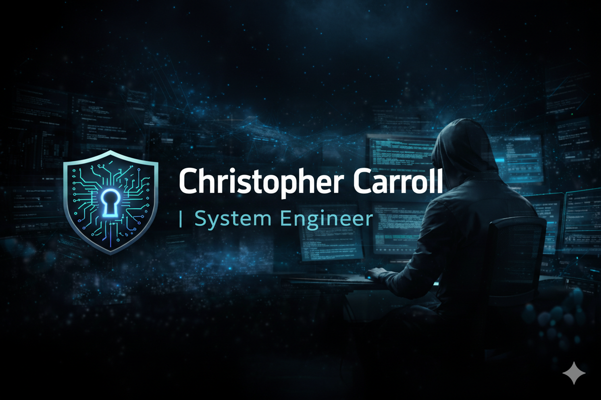

  

# Christopher Carroll | Personal Brand Site

Source code for my personal brand website.

Live site: https://carrollchristopher.github.io/

## Tech Stack
- Vite
- React
- TypeScript

## Local Development

Prerequisites:
- Node.js (LTS recommended)

Steps:
1. Install dependencies:
   npm install
2. Start the dev server:
   npm run dev

## Build

1. Build the production site:
   npm run build
2. Preview the production build locally:
   npm run preview

## Deployment

This site is deployed via GitHub Pages using GitHub Actions.
Pushes to the main branch automatically trigger a build and deploy.
